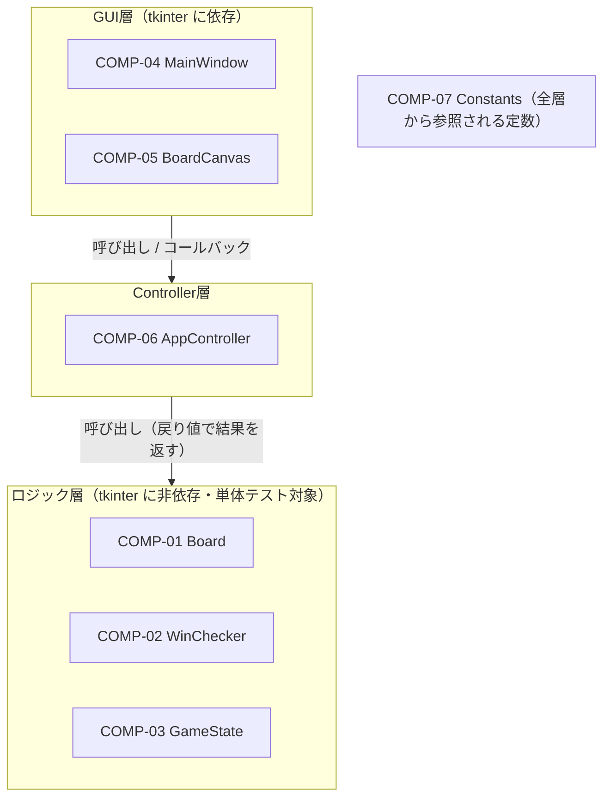
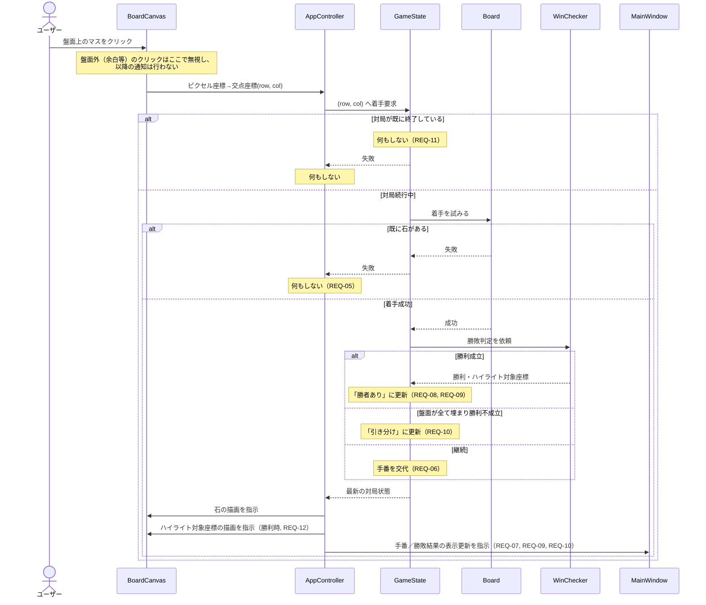
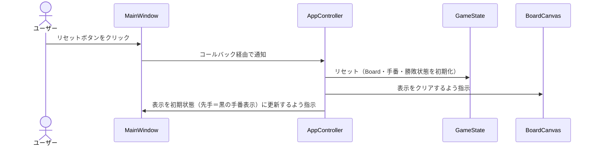

# コンポーネント設計書（基本設計）

## 1. 文書情報

| 項目 | 内容 |
|---|---|
| プロジェクト名 | 五目並べゲーム (Gomoku) |
| 版数 | 1.1 |
| 作成日 | 2026-08-11 |
| 対象 | `docs/01_requirements/requirements.md` v1.1 |

### 改訂履歴

| 版数 | 内容 |
|---|---|
| 1.0 | 初版作成・承認済み（`docs/qa_log.md` No.10） |
| 1.1 | 関数設計書レビューで検出した対応要件欄の不整合を修正。COMP-01にREQ-10、COMP-02にREQ-09、COMP-03にREQ-08・REQ-12を追加（根拠は各コンポーネントの説明を参照）。あわせて`docs/traceability_matrix.md`の要件×コンポーネント対応表を更新 |

## 2. 目的・位置づけ

要件定義書（承認済み）を実現するためのソフトウェア構成（コンポーネント分割・責務・依存関係）を定義する。
本書の内容は次工程「関数設計」の入力となる。各コンポーネントの内部関数・メソッドの入出力仕様は関数設計書（`docs/03_function_design/`）で定める。

## 3. アーキテクチャ方針

CLAUDE.md の品質方針（テスト容易性）に基づき、以下の方針でコンポーネントを分割する。

- **ロジック層とGUI層を明確に分離する**。ロジック層（盤面状態・手番管理・勝敗判定）は `tkinter` に一切依存せず、単体テスト（`tests/`）から直接インポートして検証できる構成とする。
- **GUI層はロジック層の状態を描画・入力仲介するだけ**とし、勝敗判定などのゲームルールを持たない。
- 両層をつなぐ **Controller層** を設け、GUIのクリックイベントをロジック層の操作に変換し、その結果をGUI層の描画更新に反映する。ロジック層・GUI層はController層を介して間接的にのみやり取りし、ロジック層からGUI層への直接参照は持たない。
- 盤面サイズ・セルサイズ等の可変になりうる値は `Constants` モジュールに集約する（NFR-05）。

### 3.1 レイヤー構成

依存の向きは上から下（GUI層 → Controller層 → ロジック層）のみとし、逆方向の依存（ロジック層からGUI層・Controller層への参照）は持たない。COMP-07 Constantsは全層から参照されるが、図の見やすさのため依存の矢印は省略している。

## 4. モジュール（ファイル）構成

| ファイル | コンポーネントID |
|---|---|
| `src/main.py` | エントリポイント（起動処理、NFR-02対応） |
| `src/constants.py` | COMP-07 Constants |
| `src/board.py` | COMP-01 Board |
| `src/win_checker.py` | COMP-02 WinChecker |
| `src/game_state.py` | COMP-03 GameState |
| `src/main_window.py` | COMP-04 MainWindow |
| `src/board_canvas.py` | COMP-05 BoardCanvas |
| `src/app_controller.py` | COMP-06 AppController |

## 5. コンポーネント一覧

| コンポーネントID | 名称 | 層 | 概要 |
|---|---|---|---|
| COMP-01 | Board | ロジック層 | 15×15盤面の石の配置状態を保持・操作する |
| COMP-02 | WinChecker | ロジック層 | 五連・長連の判定とハイライト対象座標の算出を行う |
| COMP-03 | GameState | ロジック層 | 手番・対局進行状態（対局中／勝敗／引き分け）を管理する |
| COMP-04 | MainWindow | GUI層 | アプリのメインウィンドウ。手番表示ラベル・リセットボタン・BoardCanvasを配置する |
| COMP-05 | BoardCanvas | GUI層 | 盤面・石・ハイライトの描画とマウスクリック位置の交点座標への変換を行う |
| COMP-06 | AppController | Controller層 | GUIイベントを受けてロジック層を操作し、結果をGUI層に反映させる |
| COMP-07 | Constants | 共通 | 盤面マス数・セルサイズ・勝利連数など各種定数を一元管理する |

## 6. コンポーネント詳細

### COMP-01 Board（盤面モデル）

- **責務**: 15×15の各交点について「空き／黒石／白石」の状態を保持する。指定座標への着手（空きマスであれば石を置く／既に石があれば置けない）と、盤面が全て埋まっているかの判定を行う。
- **主な公開操作（概要）**:
  - 指定した交点に石を置く（空きマスの場合のみ成功）
  - 指定した交点の状態を取得する
  - 盤面が全て埋まっているかを判定する
  - 盤面を初期状態（全マス空き）にリセットする
- **保持データ**: 15×15マスの状態（空き／黒／白）
- **依存**: COMP-07 Constants（盤面マス数）
- **対応要件**: REQ-04, REQ-05, REQ-10, REQ-13, NFR-05
  - REQ-10（引き分け判定）: 「盤面が全て埋まっているかの判定」はGameStateが引き分けを判定する際の直接の根拠となるため、Boardの責務として本要件に対応する

### COMP-02 WinChecker（勝敗判定ロジック）

- **責務**: 直前に石が置かれた交点を起点に、縦・横・斜め（右上がり・右下がり）の4方向で同色の石の連続数を数え、5つ以上（長連含む）連続しているかを判定する。連続している場合は、その連続部分すべての座標（ハイライト対象）を返す。
- **主な公開操作（概要）**:
  - 指定座標・指定色を起点として、勝利が成立しているかを判定する
  - 勝利成立時、ハイライト対象となる連続石の座標一覧を返す
- **保持データ**: なし（Boardの状態を引数として受け取る純粋な判定処理）
- **依存**: COMP-01 Board（盤面参照）、COMP-07 Constants（勝利に必要な連続数）
- **対応要件**: REQ-08, REQ-09, REQ-12, NFR-05, CON-02
  - REQ-09（勝利成立時の対局終了・勝者表示）: 対局終了・勝者確定のトリガーとなる勝利成立の判定そのものを担うため、GameState・MainWindow・AppControllerに加えWinCheckerも本要件に対応する

### COMP-03 GameState（対局状態管理）

- **責務**: 現在の手番（黒／白）、対局の進行状態（対局中／勝者あり／引き分け）を管理する。着手要求を受けたら Board への配置を試み、成功した場合は WinChecker で勝敗判定を行い、勝利・引き分け・手番交代のいずれかに状態を更新する。対局終了後は着手を受け付けない。
- **主な公開操作（概要）**:
  - 指定座標への着手を試みる（成否・その結果としての対局状態を返す）
  - 現在の手番を取得する
  - 対局が終了しているか、終了している場合の結果（勝者／引き分け）を取得する
  - 勝利時のハイライト対象座標を取得する
  - 対局状態をリセットする（Boardのリセットを含む）
- **保持データ**: 現在の手番、対局終了フラグ、勝者、ハイライト対象座標
- **依存**: COMP-01 Board、COMP-02 WinChecker
- **対応要件**: REQ-03, REQ-04, REQ-05, REQ-06, REQ-07, REQ-08, REQ-09, REQ-10, REQ-11, REQ-12, REQ-13, CON-01
  - REQ-08（五連・長連の判定）: 判定処理自体はWinCheckerが担うが、着手のたびにWinCheckerへ判定を依頼し結果を対局状態に反映する主体はGameStateであるため、本要件に対応する
  - REQ-12（勝利ハイライト表示）: WinCheckerの判定結果（ハイライト対象座標）を保持し、AppController経由でGUIに提供する主体はGameStateであるため、本要件に対応する

### COMP-04 MainWindow（メインウィンドウ）

- **責務**: アプリケーションのトップレベルウィンドウを構成する。手番／勝敗結果を表示するラベル、対局リセットボタン、BoardCanvas を配置する。表示内容の更新は AppController からの指示によってのみ行う（自らゲームロジックを判断しない）。
- **主な公開操作（概要）**:
  - 手番／勝敗結果の表示テキストを更新する
  - リセットボタン押下時のコールバックを登録する
- **依存**: COMP-05 BoardCanvas、COMP-07 Constants（ウィンドウサイズ）
- **対応要件**: REQ-07, REQ-09, REQ-10, REQ-13, NFR-01, NFR-05

（NFR-02「起動」への対応は `src/main.py` のエントリポイント処理が担うため、MainWindow自体の対応要件には含めない。モジュール構成（4章）参照）

### COMP-05 BoardCanvas（盤面描画・入力）

- **責務**: `tkinter.Canvas` 上に15×15の格子線・石・勝利ハイライトを描画する。マウスクリックのピクセル座標を最寄りの盤面交点座標に変換し、AppController に通知する。対局終了後のクリックについては、通知はController側の判断に委ねる（本コンポーネントは座標変換と描画のみを担当する）。クリック位置が盤面の有効範囲（余白部分含む盤面外）に対応する場合は、最寄り交点への変換を行わず、コールバックを呼び出さない（無効なクリックとして無視し、AppController・GameStateには到達させない）。有効範囲の具体的な判定方法（許容誤差の基準等）は関数設計で定める。
- **主な公開操作（概要）**:
  - 盤面グリッドを描画する
  - 指定座標に指定色の石を描画する
  - 指定座標一覧をハイライト表示する
  - 盤面表示をクリアする（リセット時）
  - クリックイベントのコールバックを登録する（有効な交点上のクリック時のみ交点座標を渡す）
- **依存**: COMP-07 Constants（盤面マス数・セルサイズ）
- **対応要件**: REQ-01, REQ-02, REQ-04, REQ-12, REQ-13, NFR-01, NFR-05

### COMP-06 AppController（アプリケーション制御）

- **責務**: BoardCanvas からのクリック通知を受け取り、GameState へ着手を要求する。結果に応じて BoardCanvas（石描画・ハイライト）と MainWindow（手番／勝敗表示）の更新を指示する。リセットボタン押下時は GameState と各GUI要素をリセットする。GUIイベント処理は同期的に行い、1クリックの処理を遅延なく完結させる（NFR-03）。
- **主な公開操作（概要）**:
  - 盤面クリック時の処理（交点座標を受け取り、着手→判定→GUI反映までを行う）
  - リセットボタン押下時の処理
  - 起動時の初期表示処理
- **依存**: COMP-03 GameState、COMP-04 MainWindow、COMP-05 BoardCanvas
- **対応要件**: REQ-04, REQ-05, REQ-06, REQ-07, REQ-09, REQ-10, REQ-11, REQ-12, REQ-13, NFR-03

### COMP-07 Constants（定数定義）

- **責務**: 盤面マス数（15）、勝利に必要な連続数（5）、セルサイズ・ウィンドウサイズ等、変更されうる値を1箇所に集約して定義する。他の全コンポーネントはこのモジュールを参照し、値をハードコーディングしない。
- **定義内容（例）**: 盤面マス数、セルサイズ（px）、盤面の余白、ウィンドウ幅・高さ、勝利連続数、石の色に対応する表示色
- **依存**: なし
- **対応要件**: NFR-05, CON-02

## 7. データフロー（シーケンス概要）

### 7.1 石を置く操作（REQ-04〜REQ-12）

### 7.2 リセット操作（REQ-13）

## 8. 今後の工程

本書のレビュー・承認後、以下を進める。

1. 各コンポーネントの内部関数・メソッドの入出力仕様を定める関数設計（`docs/03_function_design/`）
2. 実装（`src/`）
3. テスト仕様書作成・テストコード実装（`docs/04_test/`, `tests/`）

あわせて `docs/traceability_matrix.md` の「要件×コンポーネント対応表」を本書の内容で更新する。
